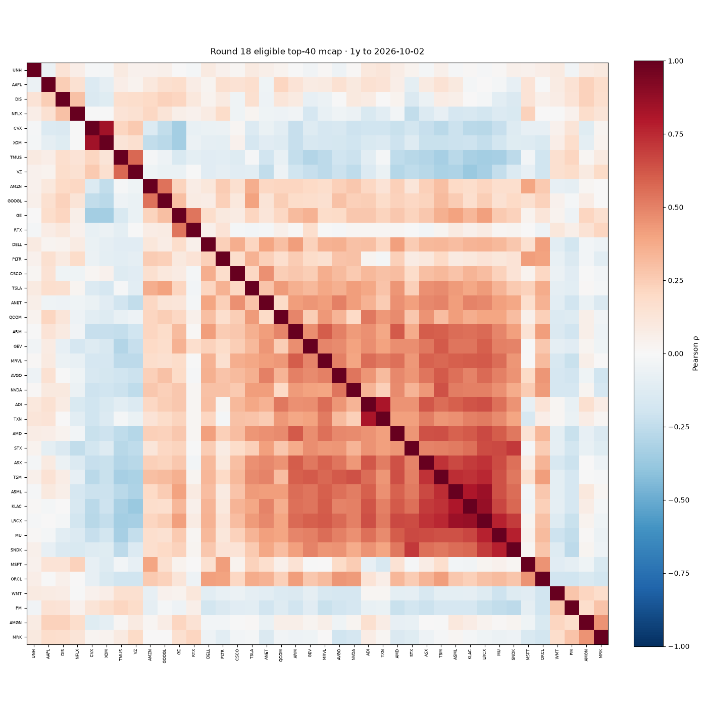

# Round 18 — ロングオンリー・ポートフォリオ研究

## 監査・修正（2026-10-04）

**不具合（修正済）**

1. **SDI リバランス:** 旧コードは「増し玉のみ」で配分が崩れていた。四半期ごとに **全売却→目標配分で再購入**に変更。
2. **SDI 手数料と配分:** 広い ETF を先に満額購入したあと、個別 15 本それぞれに **$0.35 を上乗せ**していたため、**個別スリーブが 1 株も買えず約 35% が常時現金**（ベースのみ投資→ DD が浅く見える）。**購入本数分の手数料を先に控除**してから 65/35（または 50/50）で配分するよう修正。
3. **DD 回復日数:** 旧コードは回復目標に「全期間の最高 NAV」を使い、深い DD の回復が **過小（例: −47% で 27 日）** と表示されていた。**その DD の直前ピーク**へ戻る営業日数に修正（グリッド・SDI 共通の `metricsFromCurve`）。
4. **価格データ:** `fetchDailyBars(..., range: "max")` が **日足ではなく約 400 本の月次相当**しか返さず、12–1 か月モメンタムがほぼ常に null → **個別スリーブが 2016–2024 ほぼ未投資**。Round 18 キャッシュは `range: "20y", keep: 3200` で再取得（`--fresh`）。

**50/50 最大DD −19.4% / ドキュメント −12.9% について:** いずれも **未投資スリーブ＋月次データ**の誤シミュレーション。修正後 OOS 50/50 最大DD は **下表（例: 約 −31%）**、in-sample 約 **−37%**（SPY クラッシュと同オーダー）。

### SDI 65/35 — NAV 分解（修正後・$0.35）

| 日付 | NAV | ベース(SPTM) | スリーブ | 現金 | 銘柄数 | 投資比率 |
|---|---:|---:|---:|---:|---:|---:|
| 2020-02-19 | $6788 | $4207 | $2308 | $273 | 7 | 96.0% |
| 2020-02-27 | $5826 | $3700 | $1854 | $273 | 7 | 95.3% |
| 2020-03-16 | $4581 | $2953 | $1356 | $273 | 7 | 94.1% |
| 2020-03-23 | $4323 | $2729 | $1321 | $273 | 7 | 93.7% |
| 2022-01-03 | $11204 | $7282 | $3660 | $262 | 14 | 97.7% |
| 2022-06-16 | $9153 | $5852 | $3042 | $260 | 14 | 97.2% |
| 2022-10-12 | $9059 | $5850 | $2994 | $216 | 14 | 97.6% |

### 暦年リコンシル（65/35・ベース/スリーブの年初→年末）

| 年 | SPY | ベースR | スリーブR | 0.65×base+0.35×sleeve | 実際PF | 平均現金比 |
|---|---:|---:|---:|---:|---:|---|
| 2017 | 18.5% | 21.9% | 6.7% | 16.6% | 18.1% | 0.6% 現金比 |
| 2019 | 28.7% | 31.2% | 49.7% | 37.7% | 38.8% | 0.7% 現金比 |
| 2020 | 15.1% | 31.2% | 69.9% | 44.8% | 38.9% | 1.7% 現金比 |
| 2021 | 28.8% | 29.9% | 31.7% | 30.5% | 30.2% | 1.7% 現金比 |
| 2022 | -19.9% | -13.9% | -7.0% | -11.5% | -11.2% | 2.3% 現金比 |

### 選択構成 momentum/N=10/quarterly — 四半期リバランス時の上位ウェイト（2019–2022）

- **2019-01-02:** AMD 10.0%, FTNT 10.0%, FN 10.0%, CMG 10.0%, NFLX 10.0%, CIEN 10.0%, NOW 10.0%, AMZN 10.0%, BSX 10.0%, MRK 10.0%
- **2019-04-01:** LSCC 10.0%, AMD 10.0%, FN 10.0%, CMG 10.0%, CIEN 10.0%, FTNT 10.0%, NRG 10.0%, NOW 10.0%, MRK 10.0%, CDNS 10.0%
- **2019-07-01:** LSCC 10.0%, AMD 10.0%, AMT 10.0%, CMG 10.0%, CDNS 10.0%, NOW 10.0%, CIEN 10.0%, CHTR 10.0%, WELL 10.0%, DELL 10.0%
- **2019-10-01:** LSCC 10.0%, SBUX 10.0%, CMG 10.0%, EW 10.0%, AMT 10.0%, CIEN 10.0%, CDNS 10.0%, DHR 10.0%, VRSK 10.0%, ETR 10.0%
- **2020-01-02:** CPRT 30.0%, CMG 30.0%, LSCC 3.8%, AMD 3.8%, TER 3.8%, AMKR 3.8%, LRCX 3.8%, KLAC 3.8%, ENTG 3.8%, MRVL 3.8%
- **2020-04-01:** TSLA 21.2%, MSFT 21.2%, AAPL 14.4%, TYL 14.4%, AMD 4.8%, NVDA 4.8%, LRCX 4.8%, ASML 4.8%, ENTG 4.8%, QCOM 4.8%
- **2020-07-01:** TSLA 30.0%, FTNT 15.0%, AAPL 15.0%, NVDA 4.3%, MTSI 4.3%, LSCC 4.3%, AMD 4.3%, NVMI 4.3%, SWKS 4.3%, MPWR 4.3%
- **2020-10-01:** TSLA 14.0%, BE 14.0%, AAPL 14.0%, AMZN 14.0%, NFLX 14.0%, NVDA 6.0%, AMD 6.0%, SWKS 6.0%, TSM 6.0%, NVMI 6.0%
- **2021-01-04:** TSLA 17.5%, BE 17.5%, COHR 17.5%, FCX 17.5%, SITM 5.0%, NVDA 5.0%, AMD 5.0%, LSCC 5.0%, MPWR 5.0%, ENTG 5.0%
- **2021-04-01:** TSLA 17.5%, FCX 17.5%, BE 17.5%, COHR 17.5%, SITM 5.0%, CAMT 5.0%, LSCC 5.0%, MTSI 5.0%, NVMI 5.0%, TSM 5.0%
- **2021-07-01:** FCX 10.0%, TSLA 10.0%, MOD 10.0%, BE 10.0%, SITM 10.0%, CAMT 10.0%, DVN 10.0%, LRCX 10.0%, PWR 10.0%, STLD 10.0%
- **2021-10-01:** DVN 21.2%, FTNT 21.2%, STLD 14.4%, FCX 14.4%, SITM 4.8%, CAMT 4.8%, ONTO 4.8%, AMKR 4.8%, ASX 4.8%, ASML 4.8%
- **2022-01-03:** FTNT 21.2%, TSLA 21.2%, DVN 14.4%, FANG 14.4%, SITM 4.8%, CAMT 4.8%, NVDA 4.8%, ON 4.8%, ONTO 4.8%, NVMI 4.8%
- **2022-04-01:** FTNT 13.3%, STLD 13.3%, ANET 13.3%, SITM 10.0%, NVDA 10.0%, ON 10.0%, DVN 7.5%, COP 7.5%, FANG 7.5%, EOG 7.5%
- **2022-07-01:** SITM 30.0%, DVN 3.3%, OXY 3.3%, COP 3.3%, FANG 3.3%, MPC 3.3%, EOG 3.3%, CVX 3.3%, XOM 3.3%, VLO 3.3%
- **2022-10-03:** SMCI 30.0%, OXY 3.3%, DVN 3.3%, COP 3.3%, EOG 3.3%, FANG 3.3%, XOM 3.3%, VLO 3.3%, MPC 3.3%, CVX 3.3%

### invvol N=10 quarterly（監査用・in-sample 2 位ではない）

旧レポートの **+114% / −38.5%** は **月次相当の誤データ**に起因。日足修正後の暦年:

- **2020** PF 24.8%（構成銘柄の暦年リターン上位）: TSM 81.6%, AAPL 76.7%, AMZN 71.6%, MSFT 38.5%, GOOGL 28.1%, DIS 22.3%
- **2022** PF -20.8%（構成銘柄の暦年リターン上位）: UNH 5.6%, WMT -2.0%, AVGO -15.7%, MSFT -28.4%, AAPL -28.6%, GOOGL -39.1%

---

## Small Direct Index（SPTM/SPY + 15 銘柄）

事前登録追補: `bdc45c9`（`docs/ROUND18_PREREG_SDI_ja.md`）— **本レポート最初の比較**

| 共通 | |
|---|---|
| 広いスリーブ | **SPTM**（開始 2014-01-13）。未上場日は **SPY 代理**（各バリアント四半期 0 / 44 回＝65/35 基準） |
| 個別 | **15** 銘柄・等ウェイト・**小数株**・四半期**サバイバー入替**→比率へ再平衡 |
| 条件 | 黒字（LH）・ATR14≥3%・Round 18 除外・半導体+設備 **≤4/15** |
| >15 候補 | **12–1 か月 SPY 超過**降順、同点はティッカー昇順 |

### 65/35 vs 50/50 — OOS（2021–2026-10-02・$0.35）

| | **65/35** モメンタム | **65/35** 相関分散 | **50/50** モメンタム | **50/50** 相関分散 | SPY | QQQ |
|---|---:|---:|---:|---:|---:|---:|
| CAGR | 29.1% | 29.2% | **35.1%** | 36.1% | 13.7% | 16.6% |
| 最大DD | -27.1% | -26.8% | -31.4% | -30.0% | -25.4% | -35.6% |
| DD回復(営業日) | 56 | 54 | 68 | 54 | — | — |
| 暦年プラス | 8/10 | 8/10 | 8/10 | 8/10 | — | — |
| 3条件合格 | ✗ | ✗ | ✗ | ✗ | — | — |

（SDI 相関分散 = 個別15枠を `corrdiverse` 一次ルールで選び、広いスリーブは同一。）

### 65/35 vs 50/50 — In-sample（2016–2020・$0.35）

| | 65/35 | 50/50 |
|---|---:|---:|
| CAGR | 22.0% | 26.0% |
| 最大DD | -36.3% | -36.8% |

### 手数料（OOS CAGR / 最大DD）

| 手数料 | 65/35 | 50/50 |
|---|---|---|
| $0.35 | 29.1% / -27.1% | 35.1% / -31.4% |
| $1.00 | 27.6% / -27.5% | 35.0% / -32.0% |

### 暦年リターン（$0.35）

| 年 | 65/35 | 50/50 | SPY | QQQ |
|---|---:|---:|---:|---:|
| 2017 | 18.1% | 18.5% | 18.5% | 30.3% |
| 2018 | -7.6% | -8.0% | -7.0% | -2.7% |
| 2019 | 38.8% | 43.1% | 28.7% | 37.3% |
| 2020 | 38.9% | 49.8% | 15.1% | 45.1% |
| 2021 | 30.2% | 32.5% | 28.8% | 28.6% |
| 2022 | -11.2% | -8.0% | -19.9% | -33.7% |
| 2023 | 38.3% | 39.5% | 24.8% | 54.8% |
| 2024 | 52.6% | 66.9% | 24.0% | 27.0% |
| 2025 | 37.8% | 45.3% | 16.6% | 20.4% |
| 2026 YTD | 27.8% | 33.9% | 12.7% | 22.3% |

### 合格判定（OOS $0.35・Round 18 同一基準）

| 条件 | 65/35 | 50/50 |
|---|---|---|
| CAGR ≥ 10% | ✓ (29.1%) | ✓ (35.1%) |
| 最大DD < SPY | ✗ | ✗ |
| 7/10 年プラス | ✓ | ✓ |
| 参考 ≥12% / ≥13% | ✓/✓ | ✓/✓ |
| **3条件すべて** | ✗ | ✗ |

---

## 相関分散（correlation-diversified）

事前登録追補: `9605999`（`docs/ROUND18_PREREG_CORR_ja.md`）

### 事実

- **一次:** 直近252営業日の日次リターン相関 → 平均相関が低い順に greedy 追加、既選銘柄と **ρ>0.7** ならスキップ。ウェイトは等ウェイト＋Round 18 セクター上限。
- **二次（volprune）:** ρ>0.7 ペアでボラ高い方を先に除外してから一次。
- 本編36構成の勝者選択は**変更なし**（相関は追試 36 セル）。

#### OOS CAGR / 最大DD（$0.35・**quarterly**）

| N | equal | invvol | corrdiverse | volprune |
|---:|---:|---:|---:|---:|
| 10 | 23.1% / -29.3% | 18.8% / -26.5% | 9.8% / -19.6% | 10.7% / -20.4% |
| 20 | 15.1% / -22.4% | 12.4% / -18.7% | 13.7% / -16.3% | 17.9% / -16.6% |
| 30 | 10.9% / -18.8% | 6.9% / -15.1% | 17.3% / -13.6% | 19.9% / -13.9% |

（各セル: **CAGR / 最大DD**）

OOS CAGR 最大（全36セル）: `equal/10/annual`（CAGR 24.2%、DD -29.5%）。

#### 相関ヒートマップ（2026-10-02 時点・時価総額上位40・直近1年）

**ρ > 0.7 のペア（上位40内・最大25件）**

- KLAC–LRCX: ρ=0.87
- ASML–LRCX: ρ=0.85
- CVX–XOM: ρ=0.84
- ADI–TXN: ρ=0.82
- ASML–KLAC: ρ=0.81
- MU–SNDK: ρ=0.78
- LRCX–MU: ρ=0.77
- LRCX–TSM: ρ=0.75
- ASML–TSM: ρ=0.74
- KLAC–TSM: ρ=0.73
- ASX–TSM: ρ=0.72
- ASX–LRCX: ρ=0.72
- SNDK–STX: ρ=0.70
- LRCX–SNDK: ρ=0.70

### 解釈

- equal / invvol は **時価総額上位 N** から選ぶが、corrdiverse は **全候補**から相関だけで選ぶため、セクター集中の出方が異なる。
- 二次 volprune は高相関ペアを削るが、OOS で常に優れるとは限らない（結果は上表）。
- 相関も **当日までの窓のみ**だが、銘柄集合・黒字は Round 18 同様のサバイバーシップ／ルックアヘッドあり。

---

## グリッド構成（36通り）— 事前登録

- コミット: `b8ec490`（`docs/ROUND18_PREREG_ja.md`）
- 試行構成数: **36**（多重検定に注意）
- サイト非掲載・研究のみ

## 事実（グリッド）

### ユニバース（実行時点）

- ウォッチリストから ONDS・金融・除外テーマ（SPCX 以外 space / quantum / crypto・CORZ / solar / nuclear）を除く
- **黒字:** 実行時点の Yahoo trailing EPS / TTM 純利益 → なければ EDGAR TTM（**全期間に適用＝ルックアヘッド**）
- **サバイバーシップ:** 今日のウォッチリストのみ
- 価格取得後の銘柄数: **137**

### In-sample 選択（2016–2020・手数料 $0.35）

| 順位 | 構成 | CAGR | 最大DD |
|---:|---|---:|---:|
| 1 | momentum N=10 quarterly | 31.9% | -35.6% |
| 2 | momentum N=10 monthly | 28.4% | -39.8% |
| 3 | momentum N=10 annual | 27.4% | -35.5% |
| 4 | momentum N=20 annual | 23.8% | -33.6% |
| 5 | mcap N=10 quarterly | 23.2% | -26.9% |

**選択:** **momentum/N=10/quarterly**（事前登録のタイブレーク規則）

|  | In-sample | Out-of-sample (2021–2026-10-02) |
|---|---:|---:|
| CAGR | 31.9% | **59.7%** |
| 最大DD | -35.6% | **-43.2%** |

### 選択構成 — 手数料別（OOS）

| 手数料/約定 | CAGR | 最大DD | DD回復(営業日) |
|---|---:|---:|---:|
| $0.35 | 59.7% | -43.2% | 69 |
| $1.00 | 59.2% | -43.2% | 69 |

### ベンチマーク（OOS・配当再投資相当の調整後終値）

| | CAGR | 最大DD |
|---|---:|---:|
| SPY | 13.7% | -25.4% |
| QQQ | 16.6% | -35.6% |
| SOXX | 30.8% | -46.2% |

### 暦年リターン（選択構成・$0.35）

| 年 | ポートフォリオ | SPY |
|---|---:|---:|
| 2017 | 28.9% | 18.5% |
| 2018 | -5.9% | -7.0% |
| 2019 | 39.2% | 28.7% |
| 2020 | 95.0% | 15.1% |
| 2021 | 32.0% | 28.8% |
| 2022 | -18.7% | -19.9% |
| 2023 | 85.5% | 24.8% |
| 2024 | 154.5% | 24.0% |
| 2025 | 36.5% | 16.6% |
| 2026 YTD | 106.4% | 12.7% |

プラス年数（2017–2026）: **8 / 10**

### 事前登録合格判定（OOS・$0.35）

| 条件 | 結果 |
|---|---|
| CAGR ≥ 10% | ✓ (59.7%) |
| 最大DDが SPY より浅い | ✗ (PF -43.2% vs SPY -25.4%) |
| 2017–2026 のうち7年以上プラス | ✓ (8/10) |

参考: OOS CAGR ≥ 12% → ✓；≥ 13% → ✓

## 解釈

- **In-sample vs OOS:** CAGR 31.9% → 59.7%。ギャップが大きく、2016–20 で選んだ構成の過適合を疑う。
- **多重検定:** 36 通りから in-sample 最大 CAGR を選んでいるため、OOS の有意性は過大評価されうる。
- **バイアス:** 今日のリスト・今日の黒字判定・固定株式数×価格の時価総額はいずれも過去に対するルックアヘッド／サバイバーシップ。
- **10% 目標:** 合格基準は OOS で 満たしていない。現実的な運用では 12–13% ライン（参考）も併記した。

---

*生成: `npx tsx scripts/round18-portfolio-study.ts`*
