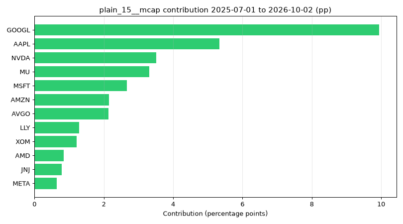

# Round 19 Corrected v1 — 採用構成の詳細レポート

**対象:** Corrected v1 再実行（事前登録 `6e3ad93`・差分リバランス・PIT データ）  
**採用構成 ID:** `plain_20__mcap_cap10`（IS 2016–2020 を `selectSakaConfig` で再計算した直近の選定結果。**STOP-SHIP データ修正後も採用 ID は再び変わる可能性がある** — 本稿は確定版ではない。）  
**初期資金:** $3200　**手数料（主計算）:** $0.35/注文  
**データ:** `data/.cache/pit/`（`docs/DATA_PIT_ja.md`）

### ヘッドライン（採用構成 vs SPY・差分リバランス $0.35/注文）

| 期間 | 採用 CAGR | SPY CAGR | 採用 MaxDD | SPY MaxDD |
|---|---:|---:|---:|---:|
| IS (2016–2020) | 17.67% | 15.42% | -27.44% | -33.72% |
| OOS (2021–2026) | 17.12% | 15.18% | -28.60% | -24.50% |

---

## 事実と解釈の区別

- **事実:** シミュレーション・EDGAR・価格キャッシュから機械的に数えた値。
- **解釈:** 因果や「なぜそうなったか」の平易な説明（検証可能な単純分解を含む）。

---

## データ修正（META 株数・XOM CIK）

**(a) META 株数:** `dei:EntityCommonStockSharesOutstanding` 欠損時は `us-gaap` の加重平均株数へフォールバック（`pit-shares.ts`）。2026-10-01 時点株数: **2,538,000,000**。

**(b) XOM CIK:** `data/pit_cik_overrides.json` で **34088**（Exxon Mobil）。黒字判定 2026-10-01: **profitable**。

| チェック | 結果 |
|---|---|
| CIK↔SEC 不一致（全 PIT 履歴銘柄） | **1** |
| GICS CSV CIK≠解決後 CIK（2026-10-01 構成員） | **1**（XOM:2115436→34088） |
| リバランス日・mcap=0（価格あり） | 直近サンプル: [{"date":"2026-07-01","tickers":["HONA","STZ"]},{"date":"2026-10-01","tickers":["STZ"]}] |

**2026-07-01 / 2026-10-01 バスケット（株数フォールバック＋XOM 修正前後）**

- **2026-07-01:** 入替: +META / -TXN
- **2026-10-01:** 入替: +META / -PLTR

---

## (1) 四半期ごとの保有履歴（2016–2026）

各リバランス日: 保有銘柄数、追加・除外ティッカー、**入替銘柄数**（追加数＝除外数）、注文内訳は (3) と一致。

| リバランス日 | 保有数 | 追加 | 除外 | 入替数 | スワップ注文 | リウェイト注文 | 手数料$0.35 |
|---|---:|---|---|---:|---:|---:|---:|
| 2016-01-04 | 20 | AAPL, GOOGL, MSFT, JNJ, AMZN, KO, PFE, FB, T, CVX, PG, WMT, MCD, VZ, MRK, PM, HD, INTC, ORCL, BMY | — | 20 | 19 | 0 | $6.65 |
| 2016-04-01 | 20 | PCG, MO | MCD, BMY | 2 | 2 | 3 | $1.75 |
| 2016-07-01 | 20 | GE | INTC | 1 | 2 | 2 | $1.40 |
| 2016-10-03 | 20 | INTC, CMCSA | ORCL, HD | 2 | 4 | 1 | $1.75 |
| 2017-01-03 | 20 | MCD, HD | PCG, MO | 2 | 2 | 3 | $1.75 |
| 2017-04-03 | 20 | PCG, MO, ORCL, BA | CVX, MCD, INTC, HD | 4 | 5 | 2 | $2.45 |
| 2017-07-03 | 20 | CVX, HD | VZ, CMCSA | 2 | 3 | 3 | $2.10 |
| 2017-10-02 | 20 | VZ | MO | 1 | 2 | 3 | $1.75 |
| 2018-01-02 | 20 | MCD, INTC, UNH | PCG, GE, ORCL | 3 | 5 | 5 | $3.50 |
| 2018-04-02 | 20 | ORCL | MCD | 1 | 2 | 3 | $1.75 |
| 2018-07-02 | 20 | TXN | PM | 1 | 1 | 2 | $1.05 |
| 2018-10-01 | 20 | CSCO | TXN | 1 | 1 | 7 | $2.80 |
| 2019-01-02 | 20 | MCD | ORCL | 1 | 1 | 5 | $2.10 |
| 2019-04-01 | 20 | TXN | MCD | 1 | 0 | 3 | $1.05 |
| 2019-07-01 | 20 | — | — | 0 | 0 | 4 | $1.40 |
| 2019-10-01 | 20 | DIS | PFE | 1 | 2 | 4 | $2.10 |
| 2020-01-02 | 20 | PFE, MCD | TXN, CSCO | 2 | 3 | 3 | $2.10 |
| 2020-04-01 | 20 | TXN, PEP, CSCO | BA, MCD, CVX | 3 | 5 | 6 | $3.85 |
| 2020-07-01 | 20 | HOLX, NVDA, NFLX, ADBE | PFE, DIS, PEP, CSCO | 4 | 7 | 7 | $4.90 |
| 2020-10-01 | 20 | CRM | HOLX | 1 | 2 | 14 | $5.60 |
| 2021-01-04 | 20 | HOLX, TSLA, MCD, PFE | NFLX, CRM, T, INTC | 4 | 7 | 15 | $7.70 |
| 2021-04-01 | 20 | INTC, CMCSA, NFLX, T | KO, MCD, PFE, ADBE | 4 | 8 | 6 | $4.90 |
| 2021-07-01 | 20 | ADBE, NKE | INTC, T | 2 | 4 | 7 | $3.85 |
| 2021-10-01 | 20 | KO, ISRG, DIS, CRM | HOLX, CMCSA, NKE, VZ | 4 | 8 | 14 | $7.70 |
| 2022-01-03 | 20 | HOLX, PFE, MCD, CVX, TMO | ISRG, MRK, ADBE, NFLX, CRM | 5 | 9 | 13 | $7.70 |
| 2022-04-01 | 20 | MRK, ABBV, LLY | MCD, TMO, DIS | 3 | 5 | 9 | $4.90 |
| 2022-07-01 | 20 | META | FB | 1 | 1 | 4 | $1.75 |
| 2022-10-03 | 20 | PEP | HOLX | 1 | 2 | 12 | $4.90 |
| 2023-01-03 | 20 | HOLX, MCD | TXN, PEP | 2 | 3 | 14 | $5.95 |
| 2023-04-03 | 20 | TXN, AVGO, ORCL | AMZN, PFE, MCD | 3 | 5 | 14 | $6.65 |
| 2023-07-03 | 20 | AMZN | ABBV | 1 | 1 | 18 | $6.65 |
| 2023-10-02 | 20 | ABBV | HOLX | 1 | 2 | 18 | $7.00 |
| 2024-01-02 | 20 | HOLX, MCD | ORCL, ABBV | 2 | 3 | 15 | $6.30 |
| 2024-04-01 | 20 | ORCL, ABBV, COST | MCD, CVX, TXN | 3 | 5 | 4 | $3.15 |
| 2024-07-01 | 20 | SMCI, TXN | NVDA, ABBV | 2 | 4 | 17 | $7.35 |
| 2024-10-01 | 20 | NVDA, LRCX, ABBV | HOLX, SMCI, TXN | 3 | 5 | 16 | $7.35 |
| 2025-01-02 | 20 | HOLX, MCD, NFLX | LRCX, MRK, ABBV | 3 | 4 | 14 | $6.30 |
| 2025-04-01 | 20 | ABBV | MCD | 1 | 2 | 4 | $2.10 |
| 2025-07-01 | 20 | PM, BKNG | UNH, ABBV | 2 | 3 | 5 | $2.80 |
| 2025-10-01 | 20 | ABBV, PLTR | HOLX, PM | 2 | 4 | 17 | $7.35 |
| 2026-01-02 | 20 | MCD, CVX, MRK | HD, PG, BKNG | 3 | 4 | 5 | $3.15 |
| 2026-04-01 | 20 | BKNG, MU | MCD, KO | 2 | 3 | 15 | $6.30 |
| 2026-07-01 | 20 | AMD, PG, TXN, AMAT, LRCX, CSCO, CAT | BKNG, COST, MRK, ORCL, NFLX, CVX, PLTR | 7 | 13 | 10 | $8.05 |
| 2026-10-01 | 20 | PLTR, ORCL, CVX | PG, TXN, CAT | 3 | 6 | 16 | $7.70 |

### 入替理由（四半期ごと）

#### 2016-01-04（入替 20 銘柄）

**追加:** 
- **+AAPL**: eligible順位 1位→1位（時価総額上位20入り）
- **+GOOGL**: eligible順位 2位→2位（時価総額上位20入り）
- **+MSFT**: eligible順位 3位→3位（時価総額上位20入り）
- **+JNJ**: eligible順位 8位→4位（時価総額上位20入り）
- **+AMZN**: eligible順位 4位→5位（時価総額上位20入り）
- **+KO**: eligible順位 5位→6位（時価総額上位20入り）
- **+PFE**: eligible順位 6位→7位（時価総額上位20入り）
- **+FB**: eligible順位 7位→8位（時価総額上位20入り）
- **+T**: eligible順位 9位→9位（時価総額上位20入り）
- **+CVX**: eligible順位 10位→10位（時価総額上位20入り）
- **+PG**: eligible順位 11位→11位（時価総額上位20入り）
- **+WMT**: eligible順位 12位→12位（時価総額上位20入り）
- **+MCD**: eligible順位 13位→13位（時価総額上位20入り）
- **+VZ**: eligible順位 14位→14位（時価総額上位20入り）
- **+MRK**: eligible順位 15位→15位（時価総額上位20入り）
- **+PM**: eligible順位 16位→16位（時価総額上位20入り）
- **+HD**: eligible順位 17位→17位（時価総額上位20入り）
- **+INTC**: eligible順位 18位→18位（時価総額上位20入り）
- **+ORCL**: eligible順位 19位→19位（時価総額上位20入り）
- **+BMY**: eligible順位 20位→20位（時価総額上位20入り）

**除外:** なし

#### 2016-04-01（入替 2 銘柄）

**追加:** 
- **+PCG**: eligible順位 115位→1位（時価総額上位20入り）
- **+MO**: eligible順位 28位→17位（時価総額上位20入り）

**除外:** 
- **−MCD**: eligible順位 13位→30位（上位20から落ち）
- **−BMY**: eligible順位 20位→31位（上位20から落ち）

#### 2016-07-01（入替 1 銘柄）

**追加:** 
- **+GE**: 新規eligible化＋eligible順位 11位（上位20入り）

**除外:** 
- **−INTC**: eligible順位 20位→22位（上位20から落ち）

#### 2016-10-03（入替 2 銘柄）

**追加:** 
- **+INTC**: eligible順位 22位→18位（時価総額上位20入り）
- **+CMCSA**: eligible順位 21位→20位（時価総額上位20入り）

**除外:** 
- **−ORCL**: eligible順位 19位→21位（上位20から落ち）
- **−HD**: eligible順位 20位→22位（上位20から落ち）

#### 2017-01-03（入替 2 銘柄）

**追加:** 
- **+MCD**: eligible順位 38位→16位（時価総額上位20入り）
- **+HD**: eligible順位 22位→20位（時価総額上位20入り）

**除外:** 
- **−PCG**: eligible順位 1位→118位（上位20から落ち）
- **−MO**: eligible順位 19位→27位（上位20から落ち）

#### 2017-04-03（入替 4 銘柄）

**追加:** 
- **+PCG**: eligible順位 118位→1位（時価総額上位20入り）
- **+MO**: eligible順位 27位→16位（時価総額上位20入り）
- **+ORCL**: eligible順位 22位→18位（時価総額上位20入り）
- **+BA**: eligible順位 21位→19位（時価総額上位20入り）

**除外:** 
- **−CVX**: 赤字（TTM・filed PIT）
- **−MCD**: eligible順位 16位→34位（上位20から落ち）
- **−INTC**: eligible順位 18位→22位（上位20から落ち）
- **−HD**: eligible順位 20位→21位（上位20から落ち）

#### 2017-07-03（入替 2 銘柄）

**追加:** 
- **+CVX**: 新規eligible化＋eligible順位 18位（上位20入り）
- **+HD**: eligible順位 21位→20位（時価総額上位20入り）

**除外:** 
- **−VZ**: eligible順位 17位→21位（上位20から落ち）
- **−CMCSA**: eligible順位 20位→22位（上位20から落ち）

#### 2017-10-02（入替 1 銘柄）

**追加:** 
- **+VZ**: eligible順位 21位→19位（時価総額上位20入り）

**除外:** 
- **−MO**: eligible順位 15位→24位（上位20から落ち）

#### 2018-01-02（入替 3 銘柄）

**追加:** 
- **+MCD**: eligible順位 32位→12位（時価総額上位20入り）
- **+INTC**: eligible順位 22位→17位（時価総額上位20入り）
- **+UNH**: eligible順位 21位→19位（時価総額上位20入り）

**除外:** 
- **−PCG**: eligible順位 1位→176位（上位20から落ち）
- **−GE**: eligible順位 17位→27位（上位20から落ち）
- **−ORCL**: eligible順位 18位→22位（上位20から落ち）

#### 2018-04-02（入替 1 銘柄）

**追加:** 
- **+ORCL**: eligible順位 22位→20位（時価総額上位20入り）

**除外:** 
- **−MCD**: eligible順位 12位→31位（上位20から落ち）

#### 2018-07-02（入替 1 銘柄）

**追加:** 
- **+TXN**: eligible順位 21位→19位（時価総額上位20入り）

**除外:** 
- **−PM**: eligible順位 15位→22位（上位20から落ち）

#### 2018-10-01（入替 1 銘柄）

**追加:** 
- **+CSCO**: 新規eligible化＋eligible順位 16位（上位20入り）

**除外:** 
- **−TXN**: eligible順位 19位→21位（上位20から落ち）

#### 2019-01-02（入替 1 銘柄）

**追加:** 
- **+MCD**: eligible順位 36位→10位（時価総額上位20入り）

**除外:** 
- **−ORCL**: eligible順位 20位→22位（上位20から落ち）

#### 2019-04-01（入替 1 銘柄）

**追加:** 
- **+TXN**: eligible順位 21位→20位（時価総額上位20入り）

**除外:** 
- **−MCD**: eligible順位 10位→28位（上位20から落ち）

#### 2019-07-01（入替 0 銘柄）

**追加:** なし

**除外:** なし

#### 2019-10-01（入替 1 銘柄）

**追加:** 
- **+DIS**: 新規eligible化＋eligible順位 15位（上位20入り）

**除外:** 
- **−PFE**: eligible順位 13位→22位（上位20から落ち）

#### 2020-01-02（入替 2 銘柄）

**追加:** 
- **+PFE**: eligible順位 22位→8位（時価総額上位20入り）
- **+MCD**: eligible順位 26位→11位（時価総額上位20入り）

**除外:** 
- **−TXN**: eligible順位 16位→21位（上位20から落ち）
- **−CSCO**: eligible順位 20位→23位（上位20から落ち）

#### 2020-04-01（入替 3 銘柄）

**追加:** 
- **+TXN**: eligible順位 21位→18位（時価総額上位20入り）
- **+PEP**: eligible順位 24位→19位（時価総額上位20入り）
- **+CSCO**: eligible順位 23位→20位（時価総額上位20入り）

**除外:** 
- **−BA**: 赤字（TTM・filed PIT）
- **−MCD**: eligible順位 11位→35位（上位20から落ち）
- **−CVX**: eligible順位 14位→29位（上位20から落ち）

#### 2020-07-01（入替 4 銘柄）

**追加:** 
- **+HOLX**: eligible順位 277位→1位（時価総額上位20入り）
- **+NVDA**: eligible順位 24位→15位（時価総額上位20入り）
- **+NFLX**: eligible順位 21位→19位（時価総額上位20入り）
- **+ADBE**: eligible順位 26位→20位（時価総額上位20入り）

**除外:** 
- **−PFE**: eligible順位 16位→23位（上位20から落ち）
- **−DIS**: eligible順位 17位→21位（上位20から落ち）
- **−PEP**: eligible順位 19位→24位（上位20から落ち）
- **−CSCO**: eligible順位 20位→22位（上位20から落ち）

#### 2020-10-01（入替 1 銘柄）

**追加:** 
- **+CRM**: 新規eligible化＋eligible順位 18位（上位20入り）

**除外:** 
- **−HOLX**: eligible順位 1位→220位（上位20から落ち）

#### 2021-01-04（入替 4 銘柄）

**追加:** 
- **+HOLX**: eligible順位 220位→1位（時価総額上位20入り）
- **+TSLA**: 新規eligible化＋eligible順位 7位（上位20入り）
- **+MCD**: eligible順位 29位→11位（時価総額上位20入り）
- **+PFE**: eligible順位 22位→12位（時価総額上位20入り）

**除外:** 
- **−NFLX**: eligible順位 17位→21位（上位20から落ち）
- **−CRM**: eligible順位 18位→28位（上位20から落ち）
- **−T**: eligible順位 19位→23位（上位20から落ち）
- **−INTC**: eligible順位 20位→27位（上位20から落ち）

#### 2021-04-01（入替 4 銘柄）

**追加:** 
- **+INTC**: eligible順位 27位→16位（時価総額上位20入り）
- **+CMCSA**: eligible順位 22位→17位（時価総額上位20入り）
- **+NFLX**: eligible順位 21位→19位（時価総額上位20入り）
- **+T**: eligible順位 23位→20位（時価総額上位20入り）

**除外:** 
- **−KO**: eligible順位 10位→22位（上位20から落ち）
- **−MCD**: eligible順位 11位→36位（上位20から落ち）
- **−PFE**: eligible順位 12位→27位（上位20から落ち）
- **−ADBE**: eligible順位 20位→21位（上位20から落ち）

#### 2021-07-01（入替 2 銘柄）

**追加:** 
- **+ADBE**: eligible順位 21位→16位（時価総額上位20入り）
- **+NKE**: eligible順位 25位→18位（時価総額上位20入り）

**除外:** 
- **−INTC**: eligible順位 16位→22位（上位20から落ち）
- **−T**: eligible順位 20位→26位（上位20から落ち）

#### 2021-10-01（入替 4 銘柄）

**追加:** 
- **+KO**: eligible順位 21位→10位（時価総額上位20入り）
- **+ISRG**: eligible順位 64位→12位（時価総額上位20入り）
- **+DIS**: 新規eligible化＋eligible順位 16位（上位20入り）
- **+CRM**: eligible順位 23位→20位（時価総額上位20入り）

**除外:** 
- **−HOLX**: eligible順位 1位→254位（上位20から落ち）
- **−CMCSA**: eligible順位 17位→21位（上位20から落ち）
- **−NKE**: eligible順位 18位→24位（上位20から落ち）
- **−VZ**: eligible順位 20位→27位（上位20から落ち）

#### 2022-01-03（入替 5 銘柄）

**追加:** 
- **+HOLX**: eligible順位 254位→1位（時価総額上位20入り）
- **+PFE**: eligible順位 23位→9位（時価総額上位20入り）
- **+MCD**: eligible順位 39位→12位（時価総額上位20入り）
- **+CVX**: 新規eligible化＋eligible順位 18位（上位20入り）
- **+TMO**: eligible順位 26位→19位（時価総額上位20入り）

**除外:** 
- **−ISRG**: eligible順位 12位→59位（上位20から落ち）
- **−MRK**: eligible順位 17位→22位（上位20から落ち）
- **−ADBE**: eligible順位 18位→24位（上位20から落ち）
- **−NFLX**: eligible順位 19位→26位（上位20から落ち）
- **−CRM**: eligible順位 20位→29位（上位20から落ち）

#### 2022-04-01（入替 3 銘柄）

**追加:** 
- **+MRK**: eligible順位 22位→17位（時価総額上位20入り）
- **+ABBV**: eligible順位 31位→18位（時価総額上位20入り）
- **+LLY**: eligible順位 373位→20位（時価総額上位20入り）

**除外:** 
- **−MCD**: eligible順位 12位→38位（上位20から落ち）
- **−TMO**: eligible順位 19位→25位（上位20から落ち）
- **−DIS**: eligible順位 20位→23位（上位20から落ち）

#### 2022-07-01（入替 1 銘柄）

**追加:** 
- **+META**: 新規eligible化＋eligible順位 11位（上位20入り）

**除外:** 
- **−FB**: S&P 500構成から除外

#### 2022-10-03（入替 1 銘柄）

**追加:** 
- **+PEP**: eligible順位 21位→20位（時価総額上位20入り）

**除外:** 
- **−HOLX**: eligible順位 2位→252位（上位20から落ち）

#### 2023-01-03（入替 2 銘柄）

**追加:** 
- **+HOLX**: eligible順位 252位→1位（時価総額上位20入り）
- **+MCD**: eligible順位 29位→10位（時価総額上位20入り）

**除外:** 
- **−TXN**: eligible順位 17位→21位（上位20から落ち）
- **−PEP**: eligible順位 20位→22位（上位20から落ち）

#### 2023-04-03（入替 3 銘柄）

**追加:** 
- **+TXN**: eligible順位 21位→15位（時価総額上位20入り）
- **+AVGO**: eligible順位 25位→19位（時価総額上位20入り）
- **+ORCL**: eligible順位 26位→20位（時価総額上位20入り）

**除外:** 
- **−AMZN**: 赤字（TTM・filed PIT）
- **−PFE**: eligible順位 7位→22位（上位20から落ち）
- **−MCD**: eligible順位 10位→27位（上位20から落ち）

#### 2023-07-03（入替 1 銘柄）

**追加:** 
- **+AMZN**: 新規eligible化＋eligible順位 5位（上位20入り）

**除外:** 
- **−ABBV**: eligible順位 18位→22位（上位20から落ち）

#### 2023-10-02（入替 1 銘柄）

**追加:** 
- **+ABBV**: eligible順位 22位→20位（時価総額上位20入り）

**除外:** 
- **−HOLX**: eligible順位 1位→256位（上位20から落ち）

#### 2024-01-02（入替 2 銘柄）

**追加:** 
- **+HOLX**: eligible順位 256位→1位（時価総額上位20入り）
- **+MCD**: eligible順位 31位→13位（時価総額上位20入り）

**除外:** 
- **−ORCL**: eligible順位 18位→23位（上位20から落ち）
- **−ABBV**: eligible順位 20位→21位（上位20から落ち）

#### 2024-04-01（入替 3 銘柄）

**追加:** 
- **+ORCL**: eligible順位 23位→18位（時価総額上位20入り）
- **+ABBV**: eligible順位 21位→19位（時価総額上位20入り）
- **+COST**: eligible順位 22位→20位（時価総額上位20入り）

**除外:** 
- **−MCD**: eligible順位 13位→35位（上位20から落ち）
- **−CVX**: eligible順位 17位→23位（上位20から落ち）
- **−TXN**: eligible順位 20位→21位（上位20から落ち）

#### 2024-07-01（入替 2 銘柄）

**追加:** 
- **+SMCI**: eligible順位 131位→12位（時価総額上位20入り）
- **+TXN**: eligible順位 21位→19位（時価総額上位20入り）

**除外:** 
- **−NVDA**: eligible順位 4位→22位（上位20から落ち）
- **−ABBV**: eligible順位 19位→21位（上位20から落ち）

#### 2024-10-01（入替 3 銘柄）

**追加:** 
- **+NVDA**: eligible順位 22位→3位（時価総額上位20入り）
- **+LRCX**: eligible順位 57位→7位（時価総額上位20入り）
- **+ABBV**: eligible順位 21位→20位（時価総額上位20入り）

**除外:** 
- **−HOLX**: eligible順位 1位→278位（上位20から落ち）
- **−SMCI**: eligible順位 12位→274位（上位20から落ち）
- **−TXN**: eligible順位 19位→21位（上位20から落ち）

#### 2025-01-02（入替 3 銘柄）

**追加:** 
- **+HOLX**: eligible順位 278位→1位（時価総額上位20入り）
- **+MCD**: eligible順位 34位→12位（時価総額上位20入り）
- **+NFLX**: eligible順位 22位→20位（時価総額上位20入り）

**除外:** 
- **−LRCX**: eligible順位 7位→86位（上位20から落ち）
- **−MRK**: eligible順位 16位→22位（上位20から落ち）
- **−ABBV**: eligible順位 20位→23位（上位20から落ち）

#### 2025-04-01（入替 1 銘柄）

**追加:** 
- **+ABBV**: eligible順位 23位→19位（時価総額上位20入り）

**除外:** 
- **−MCD**: eligible順位 12位→31位（上位20から落ち）

#### 2025-07-01（入替 2 銘柄）

**追加:** 
- **+PM**: eligible順位 21位→18位（時価総額上位20入り）
- **+BKNG**: eligible順位 25位→20位（時価総額上位20入り）

**除外:** 
- **−UNH**: eligible順位 14位→24位（上位20から落ち）
- **−ABBV**: eligible順位 19位→22位（上位20から落ち）

#### 2025-10-01（入替 2 銘柄）

**追加:** 
- **+ABBV**: eligible順位 22位→15位（時価総額上位20入り）
- **+PLTR**: eligible順位 23位→16位（時価総額上位20入り）

**除外:** 
- **−HOLX**: eligible順位 1位→285位（上位20から落ち）
- **−PM**: eligible順位 18位→21位（上位20から落ち）

#### 2026-01-02（入替 3 銘柄）

**追加:** 
- **+MCD**: eligible順位 39位→13位（時価総額上位20入り）
- **+CVX**: eligible順位 26位→18位（時価総額上位20入り）
- **+MRK**: eligible順位 22位→19位（時価総額上位20入り）

**除外:** 
- **−HD**: eligible順位 18位→23位（上位20から落ち）
- **−PG**: eligible順位 19位→27位（上位20から落ち）
- **−BKNG**: eligible順位 20位→24位（上位20から落ち）

#### 2026-04-01（入替 2 銘柄）

**追加:** 
- **+BKNG**: eligible順位 24位→1位（時価総額上位20入り）
- **+MU**: eligible順位 22位→16位（時価総額上位20入り）

**除外:** 
- **−MCD**: eligible順位 13位→42位（上位20から落ち）
- **−KO**: eligible順位 14位→27位（上位20から落ち）

#### 2026-07-01（入替 7 銘柄）

**追加:** 
- **+AMD**: eligible順位 21位→11位（時価総額上位20入り）
- **+PG**: eligible順位 24位→14位（時価総額上位20入り）
- **+TXN**: eligible順位 22位→15位（時価総額上位20入り）
- **+AMAT**: eligible順位 30位→16位（時価総額上位20入り）
- **+LRCX**: eligible順位 31位→17位（時価総額上位20入り）
- **+CSCO**: eligible順位 28位→19位（時価総額上位20入り）
- **+CAT**: eligible順位 23位→20位（時価総額上位20入り）

**除外:** 
- **−BKNG**: eligible順位 1位→36位（上位20から落ち）
- **−COST**: eligible順位 13位→24位（上位20から落ち）
- **−MRK**: eligible順位 14位→21位（上位20から落ち）
- **−ORCL**: eligible順位 15位→23位（上位20から落ち）
- **−NFLX**: eligible順位 17位→32位（上位20から落ち）
- **−CVX**: eligible順位 19位→31位（上位20から落ち）
- **−PLTR**: eligible順位 20位→33位（上位20から落ち）

#### 2026-10-01（入替 3 銘柄）

**追加:** 
- **+PLTR**: eligible順位 33位→15位（時価総額上位20入り）
- **+ORCL**: eligible順位 23位→19位（時価総額上位20入り）
- **+CVX**: eligible順位 31位→20位（時価総額上位20入り）

**除外:** 
- **−PG**: eligible順位 14位→26位（上位20から落ち）
- **−TXN**: eligible順位 15位→37位（上位20から落ち）
- **−CAT**: eligible順位 20位→22位（上位20から落ち）

全リバランス日の保有15（クリックで展開）

| 日付 | 保有ティッカー |
|---|---|
| 2016-01-04 | AAPL, GOOGL, MSFT, JNJ, AMZN, KO, PFE, FB, T, CVX, PG, WMT, MCD, VZ, MRK, PM, HD, INTC, ORCL, BMY |
| 2016-04-01 | PCG, AAPL, GOOGL, MSFT, FB, KO, JNJ, AMZN, T, PG, VZ, WMT, PM, MRK, PFE, CVX, MO, ORCL, HD, INTC |
| 2016-07-01 | PCG, AAPL, GOOGL, MSFT, AMZN, PG, JNJ, FB, KO, T, GE, VZ, WMT, PFE, PM, MRK, CVX, MO, ORCL, HD |
| 2016-10-03 | PCG, AAPL, GOOGL, MSFT, AMZN, JNJ, FB, KO, T, GE, PG, MRK, WMT, VZ, PM, PFE, CVX, INTC, MO, CMCSA |
| 2017-01-03 | AAPL, GOOGL, MSFT, JNJ, AMZN, FB, PFE, KO, CVX, T, GE, VZ, PG, MRK, WMT, MCD, PM, INTC, CMCSA, HD |
| 2017-04-03 | PCG, AAPL, GOOGL, MSFT, AMZN, FB, JNJ, KO, T, GE, PM, PG, MRK, WMT, PFE, MO, VZ, ORCL, BA, CMCSA |
| 2017-07-03 | PCG, AAPL, GOOGL, MSFT, AMZN, FB, JNJ, PG, KO, T, PM, GE, MRK, WMT, MO, ORCL, PFE, CVX, BA, HD |
| 2017-10-02 | PCG, AAPL, GOOGL, MSFT, FB, AMZN, JNJ, KO, BA, T, WMT, PM, PG, MRK, CVX, PFE, GE, ORCL, VZ, HD |
| 2018-01-02 | AAPL, GOOGL, MSFT, AMZN, FB, JNJ, PFE, KO, CVX, BA, WMT, MCD, T, PG, VZ, PM, INTC, HD, UNH, MRK |
| 2018-04-02 | AAPL, GOOGL, MSFT, AMZN, FB, JNJ, BA, KO, WMT, T, INTC, CVX, UNH, PFE, PM, HD, VZ, PG, MRK, ORCL |
| 2018-07-02 | AAPL, AMZN, GOOGL, MSFT, FB, JNJ, BA, PG, KO, WMT, T, CVX, UNH, INTC, HD, MRK, PFE, VZ, TXN, ORCL |
| 2018-10-01 | AAPL, AMZN, MSFT, GOOGL, FB, JNJ, BA, KO, WMT, PFE, UNH, MRK, T, CVX, HD, CSCO, VZ, INTC, PG, ORCL |
| 2019-01-02 | MSFT, AMZN, AAPL, GOOGL, PFE, JNJ, FB, KO, BA, MCD, WMT, MRK, CVX, VZ, UNH, PG, T, INTC, HD, CSCO |
| 2019-04-01 | MSFT, AMZN, AAPL, GOOGL, FB, JNJ, BA, KO, MRK, WMT, PG, VZ, INTC, T, CSCO, PFE, CVX, UNH, HD, TXN |
| 2019-07-01 | MSFT, AMZN, AAPL, GOOGL, FB, JNJ, KO, BA, WMT, MRK, PG, T, PFE, CVX, VZ, CSCO, HD, UNH, INTC, TXN |
| 2019-10-01 | MSFT, AAPL, AMZN, GOOGL, FB, JNJ, KO, BA, WMT, PG, MRK, T, HD, VZ, DIS, TXN, INTC, CVX, UNH, CSCO |
| 2020-01-02 | AAPL, MSFT, AMZN, GOOGL, FB, JNJ, KO, PFE, WMT, BA, MCD, MRK, PG, CVX, T, UNH, DIS, VZ, INTC, HD |
| 2020-04-01 | MSFT, AAPL, AMZN, GOOGL, FB, JNJ, WMT, KO, PG, MRK, UNH, INTC, VZ, T, HD, PFE, DIS, TXN, PEP, CSCO |
| 2020-07-01 | HOLX, AAPL, MSFT, AMZN, GOOGL, FB, PG, JNJ, WMT, KO, UNH, MRK, HD, INTC, NVDA, T, VZ, TXN, NFLX, ADBE |
| 2020-10-01 | AAPL, AMZN, MSFT, GOOGL, FB, JNJ, WMT, KO, PG, NVDA, HD, UNH, MRK, TXN, VZ, ADBE, NFLX, CRM, T, INTC |
| 2021-01-04 | HOLX, AAPL, MSFT, AMZN, GOOGL, FB, TSLA, JNJ, WMT, KO, MCD, PFE, PG, UNH, NVDA, MRK, HD, TXN, VZ, ADBE |
| 2021-04-01 | HOLX, AAPL, MSFT, AMZN, GOOGL, FB, TSLA, JNJ, WMT, UNH, NVDA, TXN, HD, PG, MRK, INTC, CMCSA, VZ, NFLX, T |
| 2021-07-01 | HOLX, AAPL, MSFT, AMZN, GOOGL, FB, TSLA, PG, NVDA, JNJ, WMT, UNH, HD, TXN, MRK, ADBE, CMCSA, NKE, NFLX, VZ |
| 2021-10-01 | AAPL, MSFT, GOOGL, AMZN, FB, TSLA, NVDA, JNJ, WMT, KO, UNH, ISRG, HD, PG, TXN, DIS, MRK, ADBE, NFLX, CRM |
| 2022-01-03 | HOLX, AAPL, MSFT, GOOGL, AMZN, TSLA, FB, NVDA, PFE, JNJ, UNH, MCD, HD, KO, WMT, PG, TXN, CVX, TMO, DIS |
| 2022-04-01 | HOLX, AAPL, MSFT, GOOGL, AMZN, TSLA, NVDA, FB, UNH, JNJ, KO, WMT, PG, CVX, TXN, HD, MRK, ABBV, PFE, LLY |
| 2022-07-01 | GOOGL, HOLX, AAPL, MSFT, AMZN, TSLA, PG, UNH, JNJ, KO, META, NVDA, WMT, MRK, PFE, LLY, HD, CVX, ABBV, TXN |
| 2022-10-03 | AAPL, MSFT, GOOGL, AMZN, TSLA, JNJ, UNH, KO, META, WMT, MRK, NVDA, PG, CVX, HD, LLY, TXN, ABBV, PFE, PEP |
| 2023-01-03 | HOLX, AAPL, MSFT, GOOGL, AMZN, JNJ, PFE, UNH, KO, MCD, CVX, MRK, WMT, PG, NVDA, LLY, TSLA, META, HD, ABBV |
| 2023-04-03 | HOLX, AAPL, MSFT, GOOGL, NVDA, TSLA, META, JNJ, UNH, KO, WMT, MRK, PG, CVX, TXN, LLY, HD, ABBV, AVGO, ORCL |
| 2023-07-03 | HOLX, AAPL, MSFT, GOOGL, AMZN, NVDA, TSLA, META, PG, JNJ, UNH, KO, WMT, LLY, MRK, AVGO, ORCL, TXN, HD, CVX |
| 2023-10-02 | AAPL, MSFT, GOOGL, AMZN, NVDA, TSLA, META, LLY, JNJ, UNH, WMT, KO, MRK, AVGO, PG, CVX, HD, ORCL, TXN, ABBV |
| 2024-01-02 | HOLX, AAPL, MSFT, GOOGL, AMZN, NVDA, META, TSLA, LLY, AVGO, JNJ, UNH, MCD, WMT, KO, MRK, CVX, PG, HD, TXN |
| 2024-04-01 | HOLX, MSFT, AAPL, NVDA, GOOGL, AMZN, META, LLY, AVGO, TSLA, JNJ, WMT, MRK, UNH, KO, PG, HD, ORCL, ABBV, COST |
| 2024-07-01 | HOLX, MSFT, AAPL, GOOGL, AMZN, META, LLY, AVGO, TSLA, PG, WMT, SMCI, MRK, JNJ, UNH, KO, ORCL, COST, TXN, HD |
| 2024-10-01 | AAPL, MSFT, NVDA, GOOGL, AMZN, META, LRCX, TSLA, LLY, AVGO, WMT, UNH, JNJ, KO, ORCL, MRK, PG, HD, COST, ABBV |
| 2025-01-02 | HOLX, AAPL, NVDA, MSFT, AMZN, GOOGL, META, TSLA, AVGO, LLY, WMT, MCD, ORCL, UNH, JNJ, KO, COST, PG, HD, NFLX |
| 2025-04-01 | HOLX, AAPL, MSFT, NVDA, AMZN, GOOGL, META, TSLA, AVGO, LLY, WMT, KO, JNJ, UNH, COST, PG, ORCL, NFLX, ABBV, HD |
| 2025-07-01 | HOLX, NVDA, MSFT, AAPL, AMZN, GOOGL, META, AVGO, TSLA, WMT, LLY, PG, ORCL, NFLX, KO, JNJ, COST, PM, HD, BKNG |
| 2025-10-01 | NVDA, MSFT, AAPL, GOOGL, AMZN, META, AVGO, TSLA, ORCL, WMT, LLY, JNJ, NFLX, KO, ABBV, PLTR, COST, HD, PG, BKNG |
| 2026-01-02 | NVDA, AAPL, GOOGL, MSFT, AMZN, AVGO, TSLA, META, LLY, WMT, JNJ, ORCL, MCD, KO, ABBV, PLTR, NFLX, CVX, MRK, COST |
| 2026-04-01 | BKNG, NVDA, AAPL, GOOGL, MSFT, AMZN, AVGO, META, TSLA, WMT, LLY, JNJ, COST, MRK, ORCL, MU, NFLX, ABBV, CVX, PLTR |
| 2026-07-01 | NVDA, GOOGL, AAPL, MSFT, AMZN, AVGO, TSLA, META, MU, LLY, AMD, WMT, JNJ, PG, TXN, AMAT, LRCX, ABBV, CSCO, CAT |
| 2026-10-01 | NVDA, AAPL, GOOGL, MSFT, AMZN, META, AVGO, TSLA, MU, LLY, AMD, WMT, JNJ, ABBV, PLTR, CSCO, LRCX, AMAT, ORCL, CVX |

---

## (2) 追加・除外の理由（要約）

- **入り:** 原則として「その日の eligible プール（黒字・価格あり・金融/テーマ除外・株クラス1本）」の**時価総額順位が上位15入り**。
- **外れ:** (a) S&P 500から外れた (b) 赤字化（TTM net income・filed日 PIT）(c) 株価/facts 欠損 (d) 順位が15位以下に低下、など。四半期別の文言は上表。

---

## (3) 四半期ごとの手数料

| 四半期 | 注文合計 | うちスワップ系 | うちリウェイト系 | 当四半期$0.35 | 累計$0.35 | 当四半期$1 | 累計$1 |
|---|---:|---:|---:|---:|---:|---:|---:|
| 2016-Q1 | 19 | 19 | 0 | $6.65 | $6.65 | $19.00 | $19.00 |
| 2016-Q2 | 5 | 2 | 3 | $1.75 | $8.40 | $5.00 | $24.00 |
| 2016-Q3 | 4 | 2 | 2 | $1.40 | $9.80 | $4.00 | $28.00 |
| 2016-Q4 | 5 | 4 | 1 | $1.75 | $11.55 | $5.00 | $33.00 |
| 2017-Q1 | 5 | 2 | 3 | $1.75 | $13.30 | $5.00 | $38.00 |
| 2017-Q2 | 7 | 5 | 2 | $2.45 | $15.75 | $7.00 | $45.00 |
| 2017-Q3 | 6 | 3 | 3 | $2.10 | $17.85 | $6.00 | $51.00 |
| 2017-Q4 | 5 | 2 | 3 | $1.75 | $19.60 | $5.00 | $56.00 |
| 2018-Q1 | 10 | 5 | 5 | $3.50 | $23.10 | $10.00 | $66.00 |
| 2018-Q2 | 5 | 2 | 3 | $1.75 | $24.85 | $5.00 | $71.00 |
| 2018-Q3 | 3 | 1 | 2 | $1.05 | $25.90 | $3.00 | $74.00 |
| 2018-Q4 | 8 | 1 | 7 | $2.80 | $28.70 | $8.00 | $82.00 |
| 2019-Q1 | 6 | 1 | 5 | $2.10 | $30.80 | $6.00 | $88.00 |
| 2019-Q2 | 3 | 0 | 3 | $1.05 | $31.85 | $3.00 | $91.00 |
| 2019-Q3 | 4 | 0 | 4 | $1.40 | $33.25 | $4.00 | $95.00 |
| 2019-Q4 | 6 | 2 | 4 | $2.10 | $35.35 | $6.00 | $101.00 |
| 2020-Q1 | 6 | 3 | 3 | $2.10 | $37.45 | $6.00 | $107.00 |
| 2020-Q2 | 11 | 5 | 6 | $3.85 | $41.30 | $11.00 | $118.00 |
| 2020-Q3 | 14 | 7 | 7 | $4.90 | $46.20 | $14.00 | $132.00 |
| 2020-Q4 | 16 | 2 | 14 | $5.60 | $51.80 | $16.00 | $148.00 |
| 2021-Q1 | 22 | 7 | 15 | $7.70 | $59.50 | $22.00 | $170.00 |
| 2021-Q2 | 14 | 8 | 6 | $4.90 | $64.40 | $14.00 | $184.00 |
| 2021-Q3 | 11 | 4 | 7 | $3.85 | $68.25 | $11.00 | $195.00 |
| 2021-Q4 | 22 | 8 | 14 | $7.70 | $75.95 | $22.00 | $217.00 |
| 2022-Q1 | 22 | 9 | 13 | $7.70 | $83.65 | $22.00 | $239.00 |
| 2022-Q2 | 14 | 5 | 9 | $4.90 | $88.55 | $14.00 | $253.00 |
| 2022-Q3 | 5 | 1 | 4 | $1.75 | $90.30 | $5.00 | $258.00 |
| 2022-Q4 | 14 | 2 | 12 | $4.90 | $95.20 | $14.00 | $272.00 |
| 2023-Q1 | 17 | 3 | 14 | $5.95 | $101.15 | $17.00 | $289.00 |
| 2023-Q2 | 19 | 5 | 14 | $6.65 | $107.80 | $19.00 | $308.00 |
| 2023-Q3 | 19 | 1 | 18 | $6.65 | $114.45 | $19.00 | $327.00 |
| 2023-Q4 | 20 | 2 | 18 | $7.00 | $121.45 | $20.00 | $347.00 |
| 2024-Q1 | 18 | 3 | 15 | $6.30 | $127.75 | $18.00 | $365.00 |
| 2024-Q2 | 9 | 5 | 4 | $3.15 | $130.90 | $9.00 | $374.00 |
| 2024-Q3 | 21 | 4 | 17 | $7.35 | $138.25 | $21.00 | $395.00 |
| 2024-Q4 | 21 | 5 | 16 | $7.35 | $145.60 | $21.00 | $416.00 |
| 2025-Q1 | 18 | 4 | 14 | $6.30 | $151.90 | $18.00 | $434.00 |
| 2025-Q2 | 6 | 2 | 4 | $2.10 | $154.00 | $6.00 | $440.00 |
| 2025-Q3 | 8 | 3 | 5 | $2.80 | $156.80 | $8.00 | $448.00 |
| 2025-Q4 | 21 | 4 | 17 | $7.35 | $164.15 | $21.00 | $469.00 |
| 2026-Q1 | 9 | 4 | 5 | $3.15 | $167.30 | $9.00 | $478.00 |
| 2026-Q2 | 18 | 3 | 15 | $6.30 | $173.60 | $18.00 | $496.00 |
| 2026-Q3 | 23 | 13 | 10 | $8.05 | $181.65 | $23.00 | $519.00 |
| 2026-Q4 | 22 | 6 | 16 | $7.70 | $189.35 | $22.00 | $541.00 |

**定義:** **スワップ系**＝そのリバランスで「前回は保有15に無かった銘柄」への新規買い、または「今回の15から外れた銘柄」の売却に伴う注文。**リウェイト系**＝継続保有銘柄のウェイト調整注文。

---

## (4) 寄与分析（2025-07-01 ～ 2026-10-02）

**方法:** 各営業日、前日終値ベースのポートフォリオウェイト × 銘柄日次リターンを積み上げ（リバランス日は目標ウェイトにリセット・手数料は本節では控除しない簡易版）。

| 銘柄 | 寄与（%ポイント） | 寄与（$・$3,200ベース） | 半導体 |
|---|---:|---:|---|
| GOOGL | +7.47pt | +$239 | — |
| AAPL | +4.93pt | +$158 | — |
| NVDA | +4.65pt | +$149 | 半導体 |
| MU | +2.85pt | +$91 | 半導体 |
| AVGO | +1.99pt | +$64 | 半導体 |
| AMZN | +1.59pt | +$51 | — |
| MSFT | +1.57pt | +$50 | — |
| JNJ | +1.40pt | +$45 | — |
| LLY | +1.24pt | +$40 | — |
| TSLA | +0.61pt | +$20 | — |
| AMD | +0.57pt | +$18 | 半導体 |
| WMT | +0.37pt | +$12 | — |
| CVX | +0.24pt | +$8 | — |
| KO | +0.20pt | +$6 | — |
| ABBV | +0.12pt | +$4 | — |
| MRK | +0.07pt | +$2 | — |
| META | +0.04pt | +$1 | — |
| MCD | +0.04pt | +$1 | — |
| HOLX | +0.00pt | +$0 | — |
| CSCO | -0.05pt | $-2 | — |

- 期間ポートリターン: **27.37%**（単純リプレイ・差分リバランス近似）
- 同期間 SPY: **26.30%** → ギャップ **1.07pt**
- 半導体サブ業種の寄与合計: **9.42pt**（全寄与の **36%**）
- 上位1/3/5銘柄の寄与シェア: **29% / 66% / 84%**
- 上位1銘柄を除いた場合の期間リターン（寄与差し引き）: **19.90%**
- 上位3銘柄を除いた場合: **10.32%**

**解釈（ギャップの単純分解）:** 本構成は金融セクターとテーマ株を持たないため SPY より大型金融・一部超大型のウェイトが薄い。期間中は半導体・大型テックの寄与がポート側のドライバーとなり、除外セクターが SPY にあって本ポートに無い分がギャップの主因となり得る（厳密な要因分析ではない）。

---

## (5) 最終リバランス（2026-10-01）で持っていない銘柄

### S&P 構成員の時価総額上位40のうち、保有15外

**eligibleだが上位15外**
  - COST（S&P時価総額順 26位・約406B USD）
  - CAT（S&P時価総額順 27位・約380B USD）
  - KO（S&P時価総額順 29位・約370B USD）
  - MRK（S&P時価総額順 30位・約355B USD）
  - DELL（S&P時価総額順 31位・約347B USD）
  - PG（S&P時価総額順 32位・約335B USD）
  - UNH（S&P時価総額順 33位・約328B USD）
  - PANW（S&P時価総額順 34位・約324B USD）
  - GE（S&P時価総額順 35位・約324B USD）
  - PM（S&P時価総額順 37位・約293B USD）
  - NFLX（S&P時価総額順 38位・約283B USD）
  - HD（S&P時価総額順 39位・約282B USD）

**株クラス重複で除外**
  - GOOG（S&P時価総額順 4位・約4096B USD）

**赤字（TTM・filed PIT）**
  - INTC（S&P時価総額順 17位・約605B USD）
  - CRWD（S&P時価総額順 40位・約272B USD）

**金融セクター除外**
  - JPM（S&P時価総額順 13位・約886B USD）
  - MA（S&P時価総額順 18位・約488B USD）
  - BAC（S&P時価総額順 28位・約376B USD）
  - MS（S&P時価総額順 36位・約295B USD）

**黒字不明（facts欠損等）**
  - XOM（S&P時価総額順 15位・約674B USD）

### eligible プールの16～25位（惜しくも15入りしなかった銘柄）

| eligible順位 | ティッカー | 時価総額（約・B USD） |
|---:|---|---:|
| 16 | CSCO | 429 |
| 17 | LRCX | 426 |
| 18 | AMAT | 420 |
| 19 | ORCL | 417 |
| 20 | CVX | 409 |
| 21 | COST | 406 |
| 22 | CAT | 380 |
| 23 | KO | 370 |
| 24 | MRK | 355 |
| 25 | DELL | 347 |

---

## (6) 暦年リターン vs SPY・最大ドローダウン

**暦年:** 前年最終営業日終値ベース（`calendarYearReturn`）。

| 年 | plain_20__mcap_cap10 | SPY | 差 |
|---|---:|---:|---:|
| 2017 | 17.9% | 21.7% | -3.8pt |
| 2018 | 2.9% | -4.6% | 7.5pt |
| 2019 | 32.8% | 31.2% | 1.5pt |
| 2020 | 24.9% | 18.3% | 6.6pt |
| 2021 | 28.3% | 28.7% | -0.4pt |
| 2022 | -25.5% | -18.2% | -7.4pt |
| 2023 | 38.3% | 26.2% | 12.1pt |
| 2024 | 40.2% | 24.9% | 15.3pt |
| 2025 | 19.7% | 17.7% | 2.0pt |
| 2026 | 10.2% | 13.7% | -3.5pt |

### 最大ドローダウン（2016-01-01–2026-10-02）

| | 採用構成 | SPY |
|---|---|---|
| ピーク日 | 2022-01-03 | 2020-02-19 |
| ボトム日 | 2023-01-05 | 2020-03-23 |
| 深さ | -28.6% | -33.7% |
| 回復 | 2023-12-15 | 2020-08-10 |
| 回復営業日数 | 238 | 97 |

---

## (7) ライブ窓シミュレーション（2026-07-30 ～ 2026-10-02）

**窓:** 2026-07-30 終値時点で **¥463,000** を USD へ換算し投資（USD/JPY **163.30** → 2026-10-02 時点 **157.93**）。  
**保有の起点:** 2026-07-01 リバランスの採用15（plain_20__mcap_cap10）。**2026-10-02** までに **2026-10-01** リバランスを適用。手数料 **$0.35/注文**（差分リバランス）。

| | USD建て | 円建て（日次 USD/JPY で換算） |
|---|---:|---:|
| 期間リターン | 8.92% | 5.34% |
| 最大DD | -2.74%（ピーク 2026-08-07 → ボトム 2026-08-20） | -4.66%（ピーク 2026-08-10 → ボトム 2026-09-09） |

**ベンチマーク（同じ USD 初期額）**

| 指数 | USD | 円建て |
|---|---:|---:|
| SPY | 4.03% | 0.60% |
| QQQ | 9.77% | 6.16% |
| SOXX | 16.80% | 12.96% |

**Emma 実績（参考・計算基準未確認）:** 約 **+10.9%**、最大 DD 約 **-6%**。

**修正前データでの暫定値（独立チェック時点・参考）:** Saka **+6.32%** USD / **+2.82%** 円、DD **-2.80%** USD / **-5.88%** 円；SPY +4.01/+0.59；QQQ +9.76/+6.15；SOXX +16.78/+12.94（USD/JPY 163.30→157.93）。

---

## (A) 選定・フィルタ規則一覧（コード根拠）

本レポートの採用構成は **`plain_20__mcap_cap10`**（選定=`plain`・N=15・ウェイト=`mcap_cap5`）。以下は **時価総額順位以外**の全フィルタ／変換をコード行番号付きで列挙する（`src/lib/round19-saka.ts` ほか）。

### 1. ユニバース（S&P 500・PIT 構成）

| 規則 | 実装 |
|---|---|
| リバランス日 `d` に **S&P 500 構成銘柄**のみ | `membersOnDate`（`src/lib/sp500-pit.ts:93-100`）— `sp500_ticker_start_end.csv` の `startDate`/`endDate` で PIT 判定（`isSp500MemberOnDate` `sp500-pit.ts:84-90`） |
| ウォッチリスト（`data/watchlist.yaml`）は **不使用** | 事前登録 `docs/ROUND19_PREREG_ja.md`・スタディは PIT S&P のみ |

### 2. テーマ／銘柄除外（eligible 前）

| 規則 | 実装 |
|---|---|
| **ONDS** は常に除外 | `isExcludedTheme` `round19-saka.ts:73-77` |
| **solar / crypto / nuclear / quantum / space** テーマ銘柄を除外 | 同上 + `themeOf`（`src/lib/themes.ts:60-66`） |
| テーマ定義リスト | SOLAR/CRYPTO/NUCLEAR/QUANTUM/SPACE 定数（`themes.ts:8-46`）。**SPCX** は `THEME_KEEP` でテーマ扱いしない（`themes.ts:48,62`）— space テーマだが **S&P 用バックテストでは space 除外リストに SPCX は含めない**（`themeOf` が null） |
| **Financials** セクター除外 | `isFinancialSector` `round19-saka.ts:79-81`（GICS sector === `"Financials"`） |

### 3. 黒字（profitability）— TTM・filed PIT

| 規則 | 実装 |
|---|---|
| 状態 | `profitabilityStatus` `round19-saka.ts:24-29` → `profitable` / `loss` / `unknown` |
| **eligible には `profitable` のみ**（`unknown`・`loss` は除外） | `filterEligibleCandidates` `round19-saka.ts:531-539`（`ctx.profitable`） |
| TTM net income | 直近 **4 四半期**（10-K/20-F/40-F 除く）の `NetIncomeLoss` 等を合算（`ttmNetIncomePitAudit` `round19-saka.ts:908-937`） |
| PIT | 各四半期ファクトは **`filed` 日 ≤ リバランス日`** のみ（`factFiledOnOrBefore` `round19-saka.ts:887-891`） |
| facts 欠損 | `unknown` → **採用プール外**（赤字扱いにしない） |

### 4. 価格・時価総額・データ

| 規則 | 実装 |
|---|---|
| **当日以前の終値が無い銘柄は除外** | `hasPrice` / `filterEligibleCandidates` `round19-saka.ts:537` |
| **別途出来高・流動性フィルタは無し** | 価格存在のみ |
| 時価総額 `mcap = 終値 × 株数`（PIT） | 株数 `pit-shares.ts` / `sharesOutstandingAsOf`；詳細レポートの `buildCtx` で stale 株数繰越 |
| `mcap ≤ 0` は **plain 選定で上位15に入らない** | `pickHoldings` `round19-saka.ts:555-559`（`.filter((r) => r.m > 0)`） |

### 5. 株クラス重複（同一 CIK）

| 規則 | 実装 |
|---|---|
| eligible 整列後 **CIK ごとに1ティッカー** | `dedupeShareClassesByCik` `pit-share-class.ts:18-37`（`filterEligibleCandidates` `round19-saka.ts:542-543`） |
| 優先ティッカー表 | `PREFERRED_OVER`（例 GOOG→GOOGL）`pit-share-class.ts:2-8`；同 CIK は **mcap 高い方**を残す |

### 6. 採用構成の「選定」(`plain`) — 時価総額順

| 規則 | 実装 |
|---|---|
| eligible の **mcap 降順**で先頭 **15** | `pickHoldings` `plain` 分岐 `round19-saka.ts:555-559` |
| ※ `corrdiverse` / `volprune` は **本採用では未使用**（252日相関 greedy・ρ>0.7 等は `round19-saka.ts:546-554, 291-374`） |

### 7. ウェイト（`mcap_cap5`）と半導体 30% キャップ

| 規則 | 実装 |
|---|---|
| まず **mcap 比例** | `targetWeights` `round19-saka.ts:585-593` |
| **単一銘柄 5% 上限**（超過は他銘柄へ再分配） | `applySingleNameCap(..., 0.05)` `round19-saka.ts:596-597`・アルゴ `407-428` |
| **半導体サブ業種**（GICS Sub-Industry に `"semiconductor"` を含む）のウェイト合計 **≤ 30%** | `isSemiSubIndustry` `round19-saka.ts:68-71`；`applySemiCap` `round19-saka.ts:431-448`（`SAKA_SEMI_CAP = 0.3` `16`）— 超過分は半導体をスケールダウンし、**非半導体に按分**（`442-447`） |

### 8. リバランス・手数料（シミュレーション）

| 規則 | 実装 |
|---|---|
| 四半期初の **最初の営業日** | `rebalanceDates` `round19-saka.ts:601-613` |
| **差分リバランス**（継続保有の微小調整はスキップ） | `simulateSaka` `rebalance: "delta"`；`|Δ$| < $25` **かつ** 相対ドリフト < **20%** ならスキップ（`round19-saka.ts:17-19, 749-750, 839-868`） |
| 手数料 | **$0.35/注文**（本レポート） |
| 初期資金 | `SAKA_INITIAL_CASH = 3200` `round19-saka.ts:11` |

### 9. In-sample 採用（30構成グリッド・本レポート外の選定手順）

| 規則 | 実装 |
|---|---|
| IS 2016-01-01～2020-12-31（`SAKA_IS_END` `9`） | |
| IS **MaxDD が SPY より浅い**構成のみ | `selectSakaConfig` `round19-saka.ts:706-716` |
| 残りから **IS CAGR 最大**、同点は **ターンオーバー低** | 同上 `712-715` |

---

## (B) 保有相関・SPY 相関／β

**対象:** 採用 `plain_20__mcap_cap10` の各リバランス日時点の **保有15**（ウェイトは `targetWeights` 適用後）。

**保有間相関（中央値）:** 各銘柄の **252 営業日**対数リターン（`SAKA_CORR_LOOKBACK` `round19-saka.ts:12`）を **日付揃え**（`pearsonOnAlignedSeries` `147-159`）し、15銘柄の **上三角ペア相関の中央値**（`medianPairwiseCorr` `249-261`）。最低 **126** 観測（`SAKA_CORR_MIN_OBS` `13`）。

**ポートフォリオ vs SPY:** リバランス日の **固定ウェイト**で日次ポート対数リターン（`Σ w_i r_i`）を構成し、同日 SPY 対数リターンと **Pearson 相関・β（OLS）**。
- **1年:** 直近 **252 営業日**（リバランス日を含む終端ウィンドウ）
- **全期間:** `2016-01-01` 以降の最初の営業日～リバランス日（同じウェイト仮定・バックテスト平均行は各四半期スナップショットの算術平均）

### 直近4リバランス

| リバランス日 | ρ中央値 | ρ平均 | ρ(ポート,SPY) 1y | β vs SPY 1y | ρ(ポート,SPY) 全期間 | β vs SPY 全期間 |
|---|---:|---:|---:|---:|---:|---:|
| 2026-01-02 | 0.224 | 0.222 | 0.947 | 1.198 | — | — |
| 2026-04-01 | 0.217 | 0.254 | 0.960 | 1.166 | — | — |
| 2026-07-01 | 0.136 | 0.152 | 0.923 | 1.409 | 0.903 | 1.266 |
| 2026-10-01 | 0.138 | 0.122 | 0.922 | 1.466 | — | — |

### 全リバランス平均（44 四半期）

| | ρ中央値 | ρ平均 | ρ(ポート,SPY) 1y | β vs SPY 1y | ρ(ポート,SPY) 全期間 | β vs SPY 全期間 |
|---|---:|---:|---:|---:|---:|---:|
| 平均 | 0.313 | 0.319 | 0.916 | 1.052 | 0.912 | 0.999 |

---

## (C) 事前登録と 2021+ データの関係（証跡）

### コミット年表（抜粋・JST）

| hash | 日時 (JST) | メッセージ |
|---|---|---|
| `ad777dc` | 2026/10/4 20:57:18 JST | docs(round19): preregister Saka Index study before any runs |
| `6e3ad93` | 2026/10/4 20:59:19 JST | docs(round19): prereg amendment — weight grid, PIT mcap, IS selection (pre-results) |
| `487152e` | 2026/10/4 21:42:23 JST | feat(round19): Saka Index — 30-config grid, PIT SP500, EDGAR mcap, report |
| `05e2d3e` | 2026/10/5 5:06:55 JST | fix(round19): full CIK map, unknown profitability, delta rebalance, corrected v1 audit |
| `e2380b8` | 2026/10/5 5:51:56 JST | feat(pit): dataset rebuild, PIT filed profitability, share-class dedup, audit v2 |
| `09acebc` | 2026/10/5 7:32:51 JST | feat(pit): resolve 745 CIKs, price aliases, coverage push; rerun Corrected v1 |
| `e2a2aec` | 2026/10/5 8:26:41 JST | Fix META shares and XOM CIK; add PIT checks and live-window detail |
| `216dfc6` | 2026/10/5 8:42:38 JST | docs(round19): add criteria, correlation, and prereg evidence to v1 detail report |
| `ef16d45` | 2026/10/5 9:40:39 JST | docs(round19): regenerate v1 detail after STOP-SHIP data fixes |

### 事前登録と OOS 結果の時間順

- **`ad777dc` / `6e3ad93`**（2026-10-04 夜 JST）: `docs/ROUND19_PREREG_ja.md` の初版と追補（30構成・IS 採用規則・半導体30%・PIT mcap 等）。**いずれも `487152e`（初回スタディ結果）より前**。
- **`487152e`**: 初回 `round19-saka-study` 実行・`docs/ROUND19_ja.md` 等の **結果コミット**（同一日・登録の約45分後 UTC）。

### 正直な限界（過大評価しない）

1. **IS 採用規則そのもの**（IS DD < SPY → IS CAGR 最大）は事前登録どおりだが、**OOS 表は初回スタディ（`487152e`）以降、リポジトリ内で繰り返し参照・再掲されている**。完全な「OOS を一度も見ずに固定」は、**結果コミット後の読者視点では成立しない**。
2. **Corrected v1 データ修正**（`05e2d3e` filed PIT 黒字、`e2380b8` PIT データセット、`09acebc` CIK/価格拡充、`e2a2aec` META/XOM）は **2021+ のバックテスト数字を見た後**に入った。これは **ルール変更ではなくデータ修正**が主だが、**IS を再計算すると採用 ID が変わる**（例: `plain_15__equal` → `plain_15__mcap_cap5`、`ROUND19_AUDIT_ja.md` / 本レポート）。
3. **差分リバランス**（$25 / 20%）は `05e2d3e` 以降の corrected v1 シミュレーションで使う。事前登録本文は主にフル清算想定；**実装・Corrected v1 は delta**（`round19-corrected-v1-study.ts` の `simOpts`）。
4. **半導体 30% キャップ**は追補 `6e3ad93` で **結果コミット前**に文書化（`applySemiCap` は `487152e` からコードに存在）。
5. **テーマリスト**（quantum 等）は `themes.ts` の watchlist 系コミットと同日の研究フロー。**Saka バックテスト専用の独立 prereg ではない**（ただし `isExcludedTheme` が参照するリストはコードで固定）。
6. **本レポートの採用構成**はデータ修正後の **再選定結果**を記載。OOS 順位・CAGR は **データ版に依存**する。
7. **STOP-SHIP 修正**（`216dfc6` 詳細レポート初版の後、`ef16d45` 付近）: PIT 時価総額の **分割調整済み終値バグ**、ATVI→MSFT CIK/価格エイリアス、CERN→ORCL 価格エイリアス削除、GOOGL レガシー facts マージ、MaxDD ピーク日、ライブ窓 USD/JPY 日付など。**本レポートは再生成版であり、採用構成 ID はまた変わる可能性がある**。

**結論:** 「2016–2020 のみでルールを決め、2021+ は一度だけ評価」は **手順として事前登録されている**が、**データ修正と再実行により採用構成は初回結果（`plain_15__equal`）と異なる**。OOS を **設計に使った**というより、**公開後にデータを直し IS をやり直した**のが正確。

---

## 解釈（全体）

- **plain_20__mcap_cap10** は mega-cap 寄りだが **5%キャップ** により単一超大株依存を抑える設計。
- Corrected v1 のデータ拡充で eligible が増え、四半期漏斗の「価格なし」は後年ほぼ解消（詳細は `ROUND19_AUDIT_ja.md`）。
- v2（ウォークフォワード主評価）は **DRAFT のみ**・本レポートの対象外。

*生成: `npx tsx scripts/round19-v1-detail-report.ts`*
