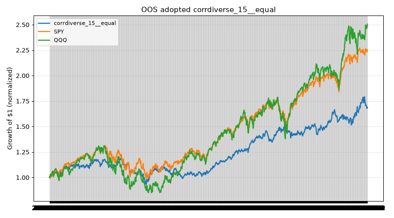

# Round 19 — Saka Index（研究）

事前登録: `6e3ad93`（`docs/ROUND19_PREREG_ja.md`）— **ウォッチリスト未使用・PIT S&P 500 のみ**

## 事実

### データ

- 構成: [fja05680/sp500](https://github.com/fja05680/sp500) `sp500_ticker_start_end.csv`
- GICS: 同 `sp500.csv`（現行・ルックアヘッド）
- 価格: Yahoo **adjclose**（分割・配当込み調整後終値、fetchDailyBars totalReturn）
- 時価総額: EDGAR companyfacts 株式数（リバランス日以前の最新）× 当日終値
- 繰り越し株数: 最終リバランスで mcap 算出可能銘柄 **132** 件中 **0.0%** が過去株数繰り越し
- SPY 暦年チェック: 2017 **21.7%**, 2018 **-4.6%**（前年最終営業日基準）

### 試行と採用

- **30** 構成（3 選定 × 2 N × 5 ウェイト）、四半期・小数株・$3,200
- IS 採用: **corrdiverse_15__equal**（IS CAGR 20.4%、IS DD -27.2%、ターンオーバー 24.5%/回）

### OOS 全構成（$0.35 約定・2021–2026-10-02）

| 順位 | 構成 | 年率 | 最大DD | プラス年% | ターンオーバー/回 | 手数料ドラッグ OOS ($0.35) | OOS ($1) |
|---:|---|---:|---:|---:|---:|---|---|
| 1 | plain_20__mcap | 17.2% | -30.7% | 80% | 10.3% | 10.4% / $333 | 29.7% / $950 |
| 2 | plain_15__mcap | 17.1% | -32.0% | 80% | 11.0% | 7.7% / $247 | 22.1% / $707 |
| 3 | plain_15__mcap_cap10 | 17.0% | -26.1% | 80% | 10.7% | 7.8% / $248 | 22.1% / $706 |
| 4 | plain_20__mcap_cap10 | 16.8% | -25.4% | 80% | 9.7% | 10.3% / $330 | 29.5% / $945 |
| 5 | plain_20__equal | 16.7% | -23.1% | 80% | 9.6% | 10.4% / $334 | 29.9% / $957 |
| 6 | plain_20__mcap_cap5 | 15.7% | -22.3% | 80% | 9.6% | 10.3% / $331 | 29.7% / $950 |
| 7 | plain_15__equal | 14.3% | -23.1% | 80% | 11.4% | 7.6% / $245 | 21.9% / $702 |
| 8 | plain_15__mcap_cap5 | 14.0% | -25.0% | 80% | 15.3% | 7.7% / $247 | 22.0% / $703 |
| 9 | plain_15__invvol | 13.9% | -18.4% | 90% | 18.8% | 7.7% / $246 | 22.1% / $707 |
| 10 | plain_20__invvol | 13.7% | -18.2% | 90% | 17.2% | 10.3% / $331 | 29.6% / $948 |
| 11 | volprune_15__equal | 11.5% | -19.7% | 90% | 24.8% | 7.7% / $246 | 21.8% / $698 |
| 12 | volprune_15__mcap_cap5 | 10.4% | -19.9% | 80% | 29.1% | 7.7% / $245 | 21.9% / $702 |
| 13 | corrdiverse_20__mcap_cap5 | 10.3% | -18.3% | 80% | 22.3% | 10.3% / $330 | 29.6% / $947 |
| 14 | volprune_15__mcap_cap10 | 10.1% | -23.9% | 80% | 27.7% | 7.7% / $245 | 21.9% / $701 |
| 15 | volprune_20__equal | 10.0% | -22.8% | 80% | 22.4% | 10.4% / $333 | 29.8% / $953 |
| 16 | corrdiverse_20__equal | 9.8% | -19.9% | 90% | 22.2% | 10.4% / $333 | 29.8% / $954 |
| 17 | volprune_20__mcap_cap5 | 9.7% | -22.7% | 80% | 22.6% | 10.3% / $329 | 29.5% / $943 |
| 18 | **corrdiverse_15__equal** | 9.5% | -22.0% | 90% | 24.5% | 7.6% / $244 | 21.9% / $702 |
| 19 | volprune_20__invvol | 9.0% | -20.9% | 80% | 29.2% | 10.3% / $330 | 29.8% / $953 |
| 20 | corrdiverse_15__mcap_cap10 | 8.9% | -22.7% | 80% | 28.0% | 7.7% / $247 | 22.0% / $704 |
| 21 | corrdiverse_15__mcap_cap5 | 8.8% | -21.6% | 90% | 29.1% | 7.7% / $246 | 22.0% / $705 |
| 22 | volprune_15__invvol | 8.8% | -20.9% | 80% | 30.8% | 7.7% / $246 | 22.3% / $712 |
| 23 | corrdiverse_15__invvol | 8.7% | -21.9% | 90% | 30.7% | 7.7% / $246 | 22.1% / $708 |
| 24 | corrdiverse_20__mcap | 8.6% | -21.1% | 70% | 33.0% | 10.3% / $330 | 29.5% / $943 |
| 25 | corrdiverse_20__invvol | 8.4% | -19.8% | 80% | 28.4% | 10.3% / $330 | 29.5% / $943 |
| 26 | volprune_15__mcap | 8.0% | -27.2% | 80% | 35.0% | 7.7% / $246 | 22.0% / $704 |
| 27 | volprune_20__mcap_cap10 | 7.8% | -23.9% | 80% | 27.7% | 10.3% / $329 | 29.3% / $939 |
| 28 | corrdiverse_20__mcap_cap10 | 7.6% | -21.0% | 80% | 27.6% | 10.3% / $329 | 29.6% / $946 |
| 29 | corrdiverse_15__mcap | 6.3% | -23.1% | 80% | 34.0% | 7.7% / $247 | 22.1% / $706 |
| 30 | volprune_20__mcap | 4.4% | -29.6% | 70% | 33.3% | 10.3% / $330 | 29.4% / $941 |
| — | **SPY** | 15.2% | -24.5% | — | — | — | — |
| — | **QQQ** | 17.3% | -35.1% | — | — | — | — |
| — | SOXX（参考） | 31.8% | -45.8% | — | — | — | — |

**採用構成の OOS 順位:** **18 / 30**（年率降順）

### 採用構成サマリ（OOS）

| 指標 | $0.35 | $1.00 |
|---|---:|---:|
| CAGR | 9.5% | 8.9% |
| 最大DD | -22.0% | -22.2% |
| プラス年% | 90% | 90% |
| OOS 手数料合計 | $244 (7.6%) | $702 (21.9%) |

**IS→OOS CAGR:** 20.4% → 9.5%

### 事前登録合格基準（OOS・$0.35）

| 基準 | 採用構成 | 判定 |
|---|---|---|
| CAGR ≥ 10% | 9.5% | 不合格 |
| 最大DD < SPY（-24.5%） | -22.0% | 合格 |
| 暦年プラス ≥ 70%（2016–2026） | 90% | 合格 |

### 暦年（採用・前年最終営業日基準）

| 年 | Saka | SPY |
|---|---:|---:|
| 2016 | — | 12.0% |
| 2017 | 19.2% | 21.7% |
| 2018 | 2.5% | -4.6% |
| 2019 | 36.0% | 31.2% |
| 2020 | 21.5% | 18.3% |
| 2021 | 16.6% | 28.7% |
| 2022 | -9.1% | -18.2% |
| 2023 | 4.6% | 26.2% |
| 2024 | 22.0% | 24.9% |
| 2025 | 9.2% | 17.7% |
| 2026 YTD | 13.2% | 13.7% |

### Saka v1 草案ホールディング

#### 採用 corrdiverse_15__equal（2026-10-01・equal）

最大ペア ρ: **0.68**

| ティッカー | GICS | ウェイト |
|---|---|---:|
| MO | Consumer Staples | 6.7% |
| VRSK | Industrials | 6.7% |
| CVX | Energy | 6.7% |
| TMUS | Communication Services | 6.7% |
| T | Communication Services | 6.7% |
| TYL | Information Technology | 6.7% |
| PM | Consumer Staples | 6.7% |
| FANG | Energy | 6.7% |
| NOW | Information Technology | 6.7% |
| VLO | Energy | 6.7% |
| DGX | Health Care | 6.7% |
| WMT | Consumer Staples | 6.7% |
| NFLX | Communication Services | 6.7% |
| AMT | Real Estate | 6.7% |
| ADSK | Information Technology | 6.7% |

#### 参考 corrdiverse_15（2026-10-01・equal）

最大ペア ρ: **0.68**

| ティッカー | GICS | ウェイト |
|---|---|---:|
| MO | Consumer Staples | 6.7% |
| VRSK | Industrials | 6.7% |
| CVX | Energy | 6.7% |
| TMUS | Communication Services | 6.7% |
| T | Communication Services | 6.7% |
| TYL | Information Technology | 6.7% |
| PM | Consumer Staples | 6.7% |
| FANG | Energy | 6.7% |
| NOW | Information Technology | 6.7% |
| VLO | Energy | 6.7% |
| DGX | Health Care | 6.7% |
| WMT | Consumer Staples | 6.7% |
| NFLX | Communication Services | 6.7% |
| AMT | Real Estate | 6.7% |
| ADSK | Information Technology | 6.7% |

#### 参考 corrdiverse_20（2026-10-01・equal）

最大ペア ρ: **0.68**

| ティッカー | GICS | ウェイト |
|---|---|---:|
| MO | Consumer Staples | 5.0% |
| VRSK | Industrials | 5.0% |
| CVX | Energy | 5.0% |
| TMUS | Communication Services | 5.0% |
| T | Communication Services | 5.0% |
| TYL | Information Technology | 5.0% |
| PM | Consumer Staples | 5.0% |
| FANG | Energy | 5.0% |
| NOW | Information Technology | 5.0% |
| VLO | Energy | 5.0% |
| DGX | Health Care | 5.0% |
| WMT | Consumer Staples | 5.0% |
| NFLX | Communication Services | 5.0% |
| AMT | Real Estate | 5.0% |
| ADSK | Information Technology | 5.0% |
| CPRT | Industrials | 5.0% |
| TJX | Consumer Discretionary | 5.0% |
| WELL | Real Estate | 5.0% |
| CHTR | Communication Services | 5.0% |
| EIX | Utilities | 5.0% |

## 解釈

- PIT 構成はサバイバーシップを下げるが、GICS・EDGAR 欠損・株数繰り越しはバイアス／保守性の残り要因。
- **30 通り**から IS で 1 つ選ぶため OOS は過適合リスクあり（順位 18）。
- 上場廃止は最終価格固定（0% その後）。

---

*生成: `npx tsx scripts/round19-saka-study.ts`*
