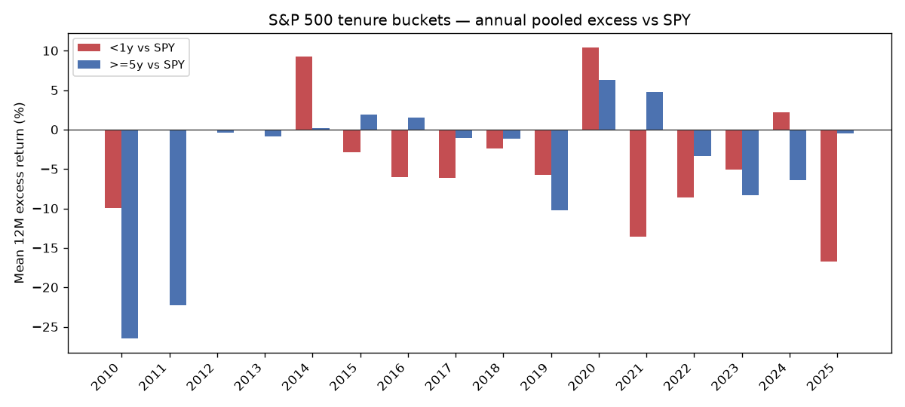

# Round 20 — S&P 500 インデックス在籍年数（テニュア）効果

事前登録: `6c32511`（`docs/ROUND20_PREREG_ja.md`）

## 事実

### データ・カバレッジ

- S&P 500 PIT: [fja05680/sp500](https://github.com/fja05680/sp500) `sp500_ticker_start_end.csv`（Round 19 同等）
- **Dow 30 PIT:** 無料で信頼できる機械可読な在籍履歴が無いため **未実施**（Wikipedia 手動履歴は本ラウンド対象外）
- 価格: Yahoo **adjclose**（`totalReturn: true`）、フォワード **252 営業日**（約 12 か月）
- SPY カレンダー: **2010-11-05** ～ **2026-10-02**（フォワード 252 日が取れる月末のみ形成、179 か月）
- 形成意図: **2010–2025-10**
- メンバー×月の試行: **89907**、フォワード価格欠損で除外: **29022**（32.3%）
- 除名イベント（期間内）: **339**、実価格フォワード不可: **235**（ストレス −50% / −100% を併記）

**生存者・データ上の注意:** 合併・ティッカー変更・上場廃止は Yahoo 終値で近似；欠損は観測除外または除名ストレス。GICS は Saka 二次表のみ現行（ルックアヘッド）。

### 在籍銘柄 — バケット別（全観測プール）

| バケット | n | 平均 TR | 中央 TR | %プラス | 平均超過 vs SPY | 平均年率ボラ | 平均最大DD |
|---|---:|---:|---:|---:|---:|---:|---:|
| lt1 | 2682 | 12.3% | 8.0% | 61.5% | -3.5% | 35.3% | -29.7% |
| 1to5 | 9635 | 10.5% | 7.1% | 59.8% | -4.4% | 34.8% | -29.3% |
| gte5 | 48568 | 13.1% | 10.3% | 66.0% | -1.6% | 29.5% | -24.6% |
| unknown | 0 | 0.0% | 0.0% | 0.0% | 0.0% | 0.0% | 0.0% |

### 年プール（形成年ごとの平均 12M TR）

| 年 | &lt;1y | 1–5y | ≥5y |
|---|---|---|---|
| 2010 | -6.7% (n=1) | -17.3% (n=6) | -23.8% (n=23) |
| 2011 | — | -24.3% (n=36) | -11.2% (n=121) |
| 2012 | — | -0.4% (n=25) | 21.5% (n=94) |
| 2013 | — | -30.4% (n=12) | 19.4% (n=87) |
| 2014 | 17.5% (n=155) | 6.9% (n=547) | 8.3% (n=3586) |
| 2015 | 2.6% (n=183) | -4.3% (n=552) | 6.7% (n=3692) |
| 2016 | 13.5% (n=303) | 17.6% (n=638) | 21.1% (n=3719) |
| 2017 | 7.4% (n=265) | 11.4% (n=781) | 12.3% (n=3797) |
| 2018 | 7.0% (n=184) | 10.8% (n=866) | 8.5% (n=3898) |
| 2019 | 6.3% (n=234) | 3.1% (n=898) | 1.2% (n=3980) |
| 2020 | 46.8% (n=303) | 45.3% (n=933) | 42.3% (n=4063) |
| 2021 | -15.0% (n=223) | -1.8% (n=945) | 2.1% (n=4246) |
| 2022 | 0.6% (n=229) | 3.8% (n=909) | 5.2% (n=4432) |
| 2023 | 22.8% (n=226) | 13.5% (n=954) | 19.6% (n=4535) |
| 2024 | 18.6% (n=228) | 3.5% (n=917) | 10.1% (n=4660) |
| 2025 | 4.2% (n=148) | 13.8% (n=616) | 20.7% (n=3635) |

### 統計: &lt;1y vs ≥5y（12M TR 平均差）

| ユニバース | 差 (lt1−gte5) | ブートストラップ 95% CI | 月数 |
|---|---:|---|---:|
| 全 S&P | -0.8% | [-2.5%, 1.0%] | 179 |
| Saka 適格 | 9.7% | [4.7%, 15.2%] | 141 |

Saka 二次: 金融・テーマ（SPCX 除く space 含む）・ONDS 除外、**TTM 黒字**（EDGAR PIT）。観測数 lt1 **400** / gte5 **9590**。

### 除名後 12 か月（104 件は実価格、欠損はストレス補完）

| シナリオ | n | 平均 TR | 平均超過 vs SPY |
|---|---:|---:|---:|
| 実価格のみ | 104 | 14.8% | -1.6% |
| 実価格 + 欠損 −50% | 328 | -29.5% | -44.6% |
| 実価格 + 欠損 −100% | 328 | -63.6% | -78.7% |

## 解釈

- テニュア・バケット間の差は **相関**であり、因果や Saka 採用の根拠にはならない。月次形成の **重なり**はブートストラップで月単位リサンプルした。
- 新規採用（&lt;1y）と長在籍（≥5y）の差の符号・有意性は上表の CI で読む。除名後はサンプルが小さくストレス仮定に依存。
- **Saka 選定への示唆（1 行）:** テニュアで例えば「採用後 1 年未満を除外」するルールは、本表だけでは採用できない。採用するなら **別ラウンドで OOS**（Round 19 型の事前登録＋単一採用）が必要。

---

*生成: `npx tsx scripts/round20-tenure-study.ts`*
